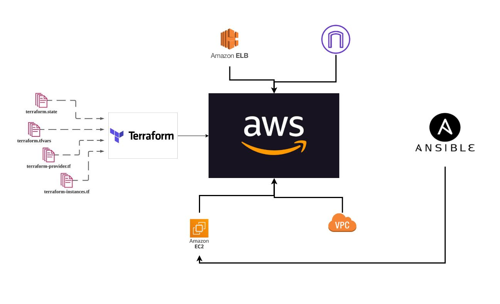
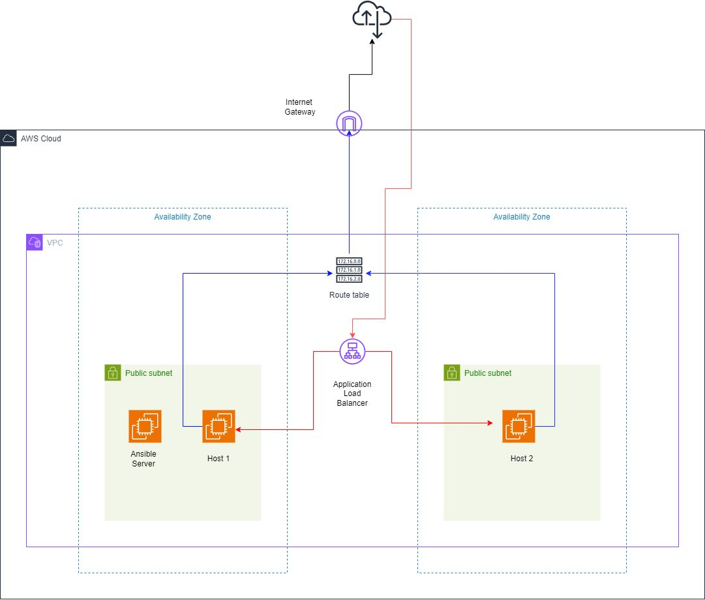

# 🚀 Automate AWS Infrastructure with Terraform & Deploy with Ansible

This project automates the provisioning of AWS infrastructure using **Terraform**, and the configuration & deployment of services using **Ansible**. Ideal for DevOps beginners who want to understand end-to-end infrastructure automation in AWS.

---

## 📁 Project Structure Diagram

> This illustrates how the folders and files are organized for both Terraform and Ansible.

<p align="center">
  
</p>

---

## 🧠 Project Goals

- Use **Terraform** to create and manage AWS infrastructure (VPC, EC2, Security Groups).
- Use **Ansible** to install and configure software on the created EC2 instances.
- Demonstrate Infrastructure as Code (IaC) and Configuration Management practices.

---

## 📊 AWS Architecture Diagram

> This shows how the infrastructure is provisioned using Terraform.


<p align="center">
  
</p>

---

---

## 🛠️ Technologies Used

- **Terraform**
- **Ansible**
- **AWS (EC2, VPC, SGs)**
- **Ubuntu/Linux**
- **SSH & CLI tools**

---

## ⚙️ Prerequisites

Install the following:

- ✅ [Terraform](https://www.terraform.io/downloads.html)
- ✅ [Ansible](https://docs.ansible.com/ansible/latest/installation_guide/intro_installation.html)
- ✅ [AWS CLI](https://docs.aws.amazon.com/cli/latest/userguide/install-cliv2.html) & configure credentials
- ✅ An AWS key pair for SSH access

---

## 🚀 How to Run

### Step 1: Clone the Repository

```bash
git clone https://github.com/KavishkaSasindu/Automate_aws_infrastructure-_with_terraform_and_automate_deployement_with_ansible.git
cd Automate_aws_infrastructure-_with_terraform_and_automate_deployement_with_ansible
```

### Step 2: Initialize AWS

```bash
cd aws
terraform init
terraform apply
```

### Step 3: Update ansible inventory

```bash
[webservers]
<your-ec2-public-ip> ansible_user=ubuntu ansible_ssh_private_key_file=~/.ssh/YOUR_KEY.pem
```

### Step 4: Run ansible playbook

```bash
cd ../ansible
ansible-playbook -i inventory playbook.yml
```

### To Clean Up

```bash
cd aws
terraform destroy
```

